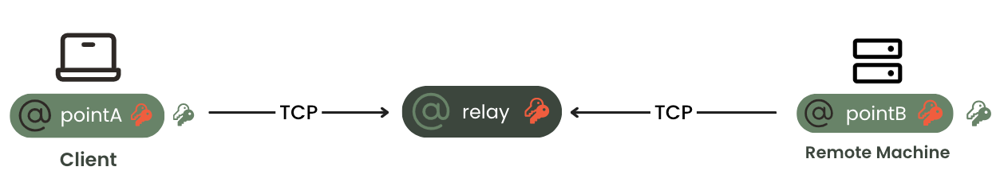

# How It Works

**What is NoPorts?** NoPorts is a zero trust security tool that uses Atsign's atPlatform to initiate connections without opening ports on either of your devices. It creates a privacy-first environment, and completely removes network attack surfaces. NoPorts is already being used in the field to do things like [replace VPNs and firewalls](https://www.noports.com/use-cases/vpn-replacement), and enable [zero trust remote access](https://www.noports.com/use-cases/remote-access).

**How does this technology work?** In the simplest explanation, NoPorts utilizes the atPlatform and atSigns to create an encrypted connection between devices over TCP/IP. An intriguing part of this technology is that TCP ports are not open on the endpoints, and the connection is completely invisible to prying eyes with no entry-point for cybersecurity attacks. Any device or application sitting behind NoPorts has no open ports, no static IP address required, and cannot be digitally hacked! This a huge leap forward in cybersecurity as there are no other solutions that can provide this level of system security. Pretty awesome right? We think so too!\
\
To further our understanding of how zero trust security is established via NoPorts, let’s briefly discuss the function of an atSign. Then, we can explore the connectivity process with easy to follow diagrams. An atSign is a resolvable address assigned to a device, person, an entire organization, or anything you like. For example, @alice could be an atSign for a person named Alice. An atSign is used to securely exchange information without any chance of surveillance, impersonation, or theft.

Now, let’s look at a diagram of a completed atSign/NoPorts connection between two devices.

<figure><figcaption></figcaption></figure>

In the diagram, you can see two devices connected with atSigns (@PointA and @PointB). The connection is established without having any open external ports on the client or remote machine and any TCP application can be setup to utilize a NoPorts connection. Because all ports are closed, the atSign encrypted tunnel is set up with outbound requests only which are sent to an atServer.&#x20;

Now, let’s discuss what an atServer is and how it functions as part of the overall atPlatform topology. An atServer is responsible for managing identity and maintaining the key-value data store for each atSign. It performs cryptographic identity validation to ensure that each entity is who they claim to be, supporting secure interactions. It serves as a secure repository and only holds data that is either explicitly made public or data that is encrypted. The atServers cannot decrypt or view any encrypted data as they do not hold the keys to decrypt it. Each atSign utilizes a separate atServer, and the atServers complete the negotiation for setting up the connection between the endpoints.

Since we now have a basic understanding of atSigns and atServers we can take a look at a more comprehensive diagram and discuss further details about the atPlatform.

<figure><figcaption>
atPlatform
</figcaption></figure>

**Connection Establishment**

So, how exactly does a NoPorts connection get established and what are the steps? Let's look at a summary overview of each step in a NoPorts connection:

1. NoPorts Client @pointA sends a request to NoPorts Relay service @relay to ask for an IP address and a pair of ports to rendezvous with Remote Machine @pointB.
2. NoPorts Relay receives the request, allocates a pair of ports on the host it is running on, responds with its IP address and the pair of ports.
3. Client receives response from Relay
4. Client sends request to the Remote Machine to connect which includes session information, the client’s intent (such as destination TCP port 3389 on localhost), and the generated public key from an ephemeral asymmetric key-pair.
5. NoPorts Daemon on Remote Machine sends request to NoPorts Policy service @policy to determine whether or not @pointA is permitted to connect to @pointB on the specified localhost port.
6. Policy service looks up information accordingly and sends response back to the daemon on Remote Machine.
   1. If request is not allowed, the daemon will not respond to the client, or send a not permitted response.
   2. If request is allowed, the daemon generates a symmetric encryption key and a socket connection to the Relay IP address and port 2. Response is sent to the Client for ‘session started’ and includes the symmetric encryption key which is encrypted with the ephemeral public key which was previously sent by the Client.
7. NoPorts daemon on Remote Machine sends response to Client as ‘session started’.
8. Client receives response and creates a socket to the Relay IP address and port 1.
9. The Relay verifies the authentication strings and joins the authenticated sockets from the Client and Remote Machine.
10. NoPorts connection established.

And that's it! At this point, the real client application (e.g. RDP) can connect to a local port on the Client to be sent over the NoPorts connection for secure remote access to the Remote Machine.

